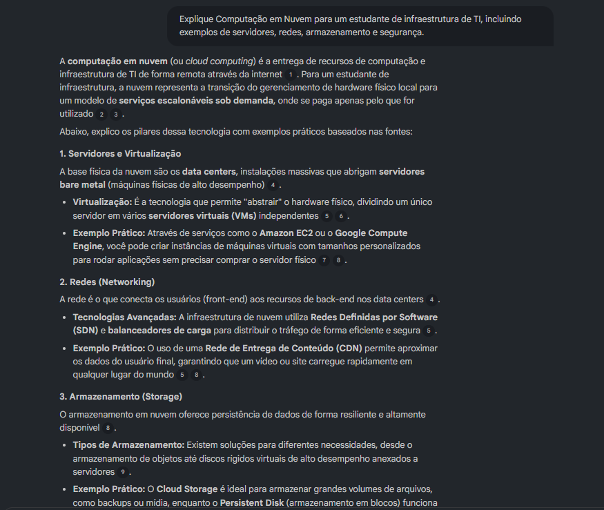

# ☁️ Miniguia de Estudos: Computação em Nuvem e Infraestrutura com NotebookLM

## 📌 Sobre o Projeto

Este projeto foi desenvolvido como parte de um desafio da **DIO (Digital Innovation One)**, utilizando o NotebookLM como ferramenta de aprendizagem ativa.

O objetivo foi explorar como a Inteligência Artificial pode auxiliar no processo de estudo, organização de informações e construção de conhecimento técnico.

O tema escolhido foi **Computação em Nuvem e Infraestrutura**, uma área fundamental para profissionais de tecnologia, envolvendo conceitos como servidores, redes, virtualização, armazenamento e segurança em ambientes Cloud.

---

# 🎯 Objetivos

Durante este estudo, busquei:

- Compreender os fundamentos da Computação em Nuvem;
- Entender os modelos de serviço Cloud;
- Conhecer conceitos de infraestrutura e virtualização;
- Estudar práticas de segurança em ambientes de nuvem;
- Desenvolver habilidades de Engenharia de Prompts;
- Utilizar IA como ferramenta de apoio ao aprendizado.

---

# ☁️ Tema Estudado

## Computação em Nuvem e Infraestrutura

Computação em Nuvem é um modelo que permite utilizar recursos computacionais através da internet, como servidores, armazenamento, bancos de dados e redes.

Ao invés de uma empresa manter toda uma infraestrutura física própria, ela pode utilizar recursos fornecidos por grandes provedores de nuvem.

Principais conceitos estudados:

- Cloud Computing;
- Data Centers;
- Virtualização;
- Máquinas Virtuais;
- Redes;
- Armazenamento;
- Segurança;
- Alta disponibilidade;
- Escalabilidade.

---

# 📚 Curadoria de Fontes

As fontes utilizadas no NotebookLM foram:

## AWS - Amazon Web Services

AWS Cloud Practitioner Essentials

https://aws.amazon.com/pt/training/digital/aws-cloud-practitioner-essentials/

Conteúdos:
- Fundamentos de Cloud;
- Serviços AWS;
- Segurança;
- Escalabilidade.

---

## Microsoft Azure

Fundamentos de Computação em Nuvem

https://learn.microsoft.com/pt-br/training/modules/describe-cloud-service-types/

Conteúdos:
- IaaS;
- PaaS;
- SaaS;
- Modelos de implantação.

---

## Google Cloud

Introdução à Computação em Nuvem

https://cloud.google.com/learn/what-is-cloud-computing?hl=pt-br

Conteúdos:
- Infraestrutura Cloud;
- Benefícios da nuvem;
- Serviços gerenciados.

---

## IBM Cloud

Conceitos de Cloud Computing

https://www.ibm.com/br-pt/topics/cloud-computing

Conteúdos:
- Conceitos fundamentais;
- Casos de uso;
- Evolução da nuvem.

---

## CNCF - Cloud Native Computing Foundation

https://www.cncf.io/

Conteúdos:
- Containers;
- Kubernetes;
- Aplicações Cloud Native.

---

# 🖼️ Evidências do NotebookLM

## Fontes adicionadas

As fontes foram inseridas no NotebookLM para análise e geração de conhecimento.


---

# 🤖 Engenharia de Prompts

Durante o estudo foram realizados testes de prompts buscando melhorar a qualidade das respostas geradas pela IA.

---

## Prompt 1 - Explicação inicial

### Pergunta:

> Explique Computação em Nuvem para um estudante iniciante de infraestrutura de TI.

### Resultado:

O NotebookLM apresentou uma explicação dos conceitos básicos de Cloud Computing, comparando infraestrutura tradicional com ambientes em nuvem.

### Aprendizado:

Prompts mais específicos geram respostas mais direcionadas ao objetivo do estudo.

Imagem:



---

# Prompt 2 - Melhoria do Prompt

### Primeira tentativa:

> Explique cloud computing.

### Problema encontrado:

A resposta foi muito genérica e apresentou poucos exemplos técnicos.

---

### Prompt melhorado:

> Explique Computação em Nuvem para um estudante de infraestrutura de TI, incluindo servidores, redes, armazenamento e segurança.

### Resultado:

A resposta apresentou maior profundidade e exemplos mais próximos da realidade profissional.

Imagem:


---

# 🩹 Cicatrizes e Troubleshooting

Durante o uso do NotebookLM encontrei alguns desafios:

## Respostas superficiais

**Problema:**
Perguntas muito curtas geravam respostas genéricas.

**Solução:**
Detalhar melhor o contexto e informar o nível de conhecimento esperado.

---

## Excesso de informações

**Problema:**
Algumas respostas apresentavam muitos detalhes.

**Solução:**
Solicitar respostas organizadas em tópicos, tabelas e resumos.

Imagem:


---

# 📖 Miniguia de Estudos

## Modelos de Serviço Cloud

### IaaS (Infrastructure as a Service)

Fornece infraestrutura virtualizada.

Exemplos:

- Máquinas virtuais;
- Redes;
- Armazenamento.

---

### PaaS (Platform as a Service)

Fornece uma plataforma pronta para desenvolvimento de aplicações.

Exemplos:

- Ambientes gerenciados;
- Ferramentas de desenvolvimento.

---

### SaaS (Software as a Service)

Disponibiliza softwares através da internet.

Exemplos:

- Sistemas corporativos;
- Aplicações online.

---

# 🔐 Segurança em Nuvem

Principais práticas:

- Autenticação multifator;
- Controle de acesso;
- Criptografia;
- Monitoramento;
- Backup;
- Recuperação de desastres.

---

# 📘 Glossário

| Termo | Definição |
|-|-|
| Cloud Computing | Uso de recursos computacionais pela internet |
| Data Center | Local onde servidores são armazenados |
| Virtualização | Criação de recursos virtuais através de software |
| Máquina Virtual | Computador criado virtualmente |
| IaaS | Infraestrutura como Serviço |
| PaaS | Plataforma como Serviço |
| SaaS | Software como Serviço |
| Escalabilidade | Capacidade de aumentar recursos conforme demanda |
| Alta disponibilidade | Garantia de funcionamento contínuo |
| Backup | Cópia de segurança dos dados |

---

# 🚀 Prompts Reutilizáveis

```
Explique este conceito como se eu fosse iniciante.

Resuma este documento em tópicos.

Crie um mapa mental sobre este assunto.

Compare conceitos utilizando uma tabela.

Crie perguntas de revisão com respostas.

Apresente exemplos utilizados no mercado.
```

---

# ✅ Conclusão

Este projeto demonstrou como a Inteligência Artificial pode ser utilizada como uma ferramenta de aprendizagem, auxiliando na pesquisa, organização e revisão de conteúdos técnicos.

O uso do NotebookLM permitiu desenvolver não apenas conhecimento sobre Computação em Nuvem e Infraestrutura, mas também habilidades de Engenharia de Prompts, análise crítica e organização do conhecimento.

---

## 👨‍💻 Autor

Projeto desenvolvido como desafio da DIO.

Tema:
**Computação em Nuvem e Infraestrutura ☁️**
